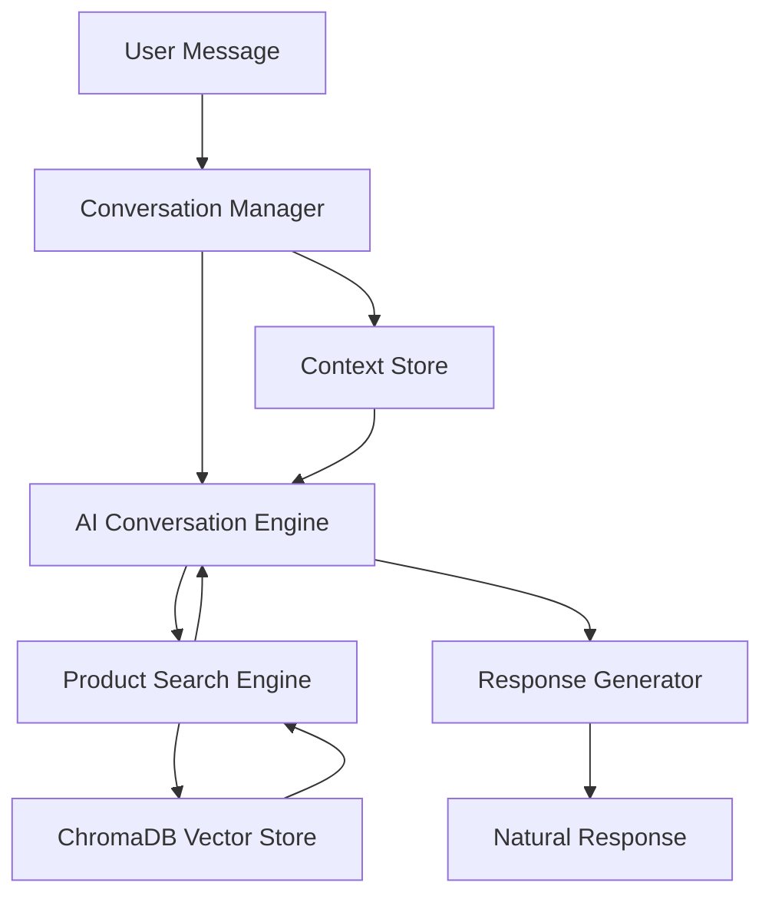

# Design Document

## Overview

The new XOFlowers Conversational AI Intelligence system will replace the current template-based approach with a truly conversational AI that understands natural language, maintains context, and generates personalized responses. The system will use ChromaDB for semantic product search and advanced AI models for natural conversation generation.

## Architecture

### High-Level Architecture



### Core Components

1. **Conversation Manager** - Orchestrates the entire conversation flow
2. **AI Conversation Engine** - Handles natural language understanding and generation
3. **Context Store** - Maintains conversation memory and user preferences
4. **Product Search Engine** - Performs semantic search using ChromaDB
5. **Response Generator** - Creates natural, contextual responses

## Components and Interfaces

### 1. Conversation Manager (`conversation_manager.py`)

**Purpose:** Central orchestrator that manages the conversation flow and coordinates between components.

**Key Methods:**
```python
class ConversationManager:
    async def process_message(self, user_id: str, message: str) -> str:
        """Process user message and return natural response"""
        
    async def get_conversation_context(self, user_id: str) -> ConversationContext:
        """Retrieve conversation context for user"""
        
    async def update_context(self, user_id: str, context_update: dict):
        """Update conversation context with new information"""
```

**Interfaces:**
- Input: User message, user ID
- Output: Natural language response
- Dependencies: AI Engine, Context Store, Product Search

### 2. AI Conversation Engine (`ai_conversation_engine.py`)

**Purpose:** Handles natural language understanding and response generation using advanced AI models.

**Key Methods:**
```python
class AIConversationEngine:
    async def understand_message(self, message: str, context: ConversationContext) -> MessageUnderstanding:
        """Understand user message in context"""
        
    async def generate_response(self, understanding: MessageUnderstanding, products: List[Product]) -> str:
        """Generate natural conversational response"""
        
    async def extract_search_intent(self, message: str, context: ConversationContext) -> SearchIntent:
        """Extract product search intent from conversation"""
```

**AI Model Configuration:**
- Primary: OpenAI GPT-4 for natural conversation
- Fallback: Google Gemini Pro for reliability
- Specialized prompts for florist expertise
- Context-aware prompt engineering

### 3. Context Store (`context_store.py`)

**Purpose:** Manages conversation memory, user preferences, and session state.

**Data Models:**
```python
@dataclass
class ConversationContext:
    user_id: str
    conversation_history: List[Message]
    user_preferences: UserPreferences
    current_session: SessionState
    mentioned_products: List[str]
    budget_range: Optional[Tuple[float, float]]
    occasion_context: Optional[str]
    
@dataclass
class UserPreferences:
    preferred_colors: List[str]
    preferred_styles: List[str]
    budget_history: List[float]
    past_purchases: List[str]
    
@dataclass
class SessionState:
    active_search: Optional[SearchIntent]
    comparing_products: List[str]
    conversation_stage: str
```

**Storage:**
- JSON files for conversation history
- In-memory cache for active sessions
- Persistent storage for user preferences

### 4. Product Search Engine (`semantic_search_engine.py`)

**Purpose:** Performs intelligent semantic search using ChromaDB vector database.

**Key Methods:**
```python
class SemanticSearchEngine:
    async def search_products(self, search_intent: SearchIntent, context: ConversationContext) -> List[Product]:
        """Perform semantic search for products"""
        
    async def find_similar_products(self, product_id: str, limit: int = 5) -> List[Product]:
        """Find products similar to given product"""
        
    async def filter_by_context(self, products: List[Product], context: ConversationContext) -> List[Product]:
        """Filter products based on conversation context"""
```

**ChromaDB Collections:**
- `products_main` - Primary product collection with full descriptions
- `products_categories` - Category-based product groupings
- `products_occasions` - Occasion-specific product mappings
- `products_price_ranges` - Price-based product segments

### 5. Response Generator (`response_generator.py`)

**Purpose:** Creates natural, contextual responses that integrate product information seamlessly.

**Key Methods:**
```python
class ResponseGenerator:
    async def create_response(self, understanding: MessageUnderstanding, products: List[Product], context: ConversationContext) -> str:
        """Create natural conversational response"""
        
    async def integrate_products(self, base_response: str, products: List[Product]) -> str:
        """Naturally integrate product information into response"""
        
    async def handle_no_results(self, search_intent: SearchIntent, context: ConversationContext) -> str:
        """Handle cases where no products match the search"""
```

## Data Models

### Product Model
```python
@dataclass
class Product:
    id: str
    name: str
    description: str
    price: float
    category: str
    colors: List[str]
    occasions: List[str]
    availability: bool
    image_url: Optional[str]
    vector_embedding: Optional[List[float]]
    
    def to_conversational_description(self) -> str:
        """Convert product to natural description for conversation"""
```

### Message Understanding Model
```python
@dataclass
class MessageUnderstanding:
    original_message: str
    intent_type: str  # 'product_search', 'question', 'comparison', etc.
    entities: Dict[str, Any]  # extracted entities like colors, prices, occasions
    sentiment: str
    requires_search: bool
    search_intent: Optional[SearchIntent]
    
@dataclass
class SearchIntent:
    query: str
    filters: Dict[str, Any]
    budget_range: Optional[Tuple[float, float]]
    occasion: Optional[str]
    preferences: Dict[str, Any]
```

## ChromaDB Vector Database Design

### Database Structure

**Collections:**
1. **products_main** - Primary product collection
   - Documents: Full product descriptions with rich context
   - Metadata: price, category, availability, colors, occasions
   - Embeddings: Generated from comprehensive product descriptions

2. **products_categories** - Category-specific collections
   - Separate collections for: bouquets, gift_boxes, plants, accessories
   - Specialized embeddings for category-specific searches

3. **products_occasions** - Occasion-based groupings
   - Collections for: weddings, anniversaries, birthdays, sympathy
   - Context-aware embeddings for occasion matching

### Vectorization Strategy

**Embedding Model:** `sentence-transformers/all-MiniLM-L6-v2`
- Fast inference for real-time search
- Good balance of quality and performance
- Romanian language support

**Document Preparation:**
```python
def create_product_document(product: Product) -> str:
    """Create rich document for vectorization"""
    return f"""
    {product.name}
    Descriere: {product.description}
    Categorie: {product.category}
    Culori: {', '.join(product.colors)}
    Ocazii: {', '.join(product.occasions)}
    Preț: {product.price} MDL
    Context: Flori proaspete de la XOFlowers Chișinău
    """
```

**Search Strategy:**
- Cosine similarity for semantic matching
- Hybrid search combining vector similarity with metadata filtering
- Context-aware re-ranking based on conversation history

### Database Initialization

```python
class ChromaDBSetup:
    def initialize_collections(self):
        """Initialize all required collections"""
        
    def populate_products(self, products: List[Product]):
        """Populate database with vectorized products"""
        
    def create_embeddings(self, products: List[Product]) -> List[List[float]]:
        """Generate embeddings for products"""
```

## Error Handling

### AI Service Fallback
```python
class AIServiceManager:
    async def get_ai_response(self, prompt: str) -> str:
        try:
            return await self.openai_client.generate(prompt)
        except Exception:
            return await self.gemini_client.generate(prompt)
```

### Database Error Handling
```python
class DatabaseErrorHandler:
    async def handle_search_error(self, error: Exception) -> List[Product]:
        """Handle database search errors gracefully"""
        
    async def fallback_search(self, query: str) -> List[Product]:
        """Provide fallback search when vector search fails"""
```

### Conversation Error Recovery
- Graceful degradation when AI services fail
- Context preservation during errors
- Natural error messages that don't break conversation flow

## Testing Strategy

### Unit Tests
- Individual component testing
- Do not Mock AI responses for consistent testing
- ChromaDB operations testing
- Context management testing

### Integration Tests
- End-to-end conversation flows
- AI service integration testing
- Database integration testing
- Error handling scenarios

### Conversation Quality Tests
- Natural language response evaluation
- Context preservation testing
- Product recommendation accuracy
- User experience flow testing

### Performance Tests
- Response time benchmarking (target: <3 seconds)
- ChromaDB search performance
- Memory usage optimization
- Concurrent user handling

## Security and Privacy

### Data Protection
- Conversation data anonymization
- Secure storage of user preferences
- GDPR compliance for user data
- Automatic data cleanup policies

### AI Safety
- Content filtering for inappropriate requests
- Business context enforcement
- Jailbreak protection through conversation design
- Rate limiting for abuse prevention

## Deployment and Monitoring

### Monitoring Metrics
- Conversation quality scores
- Response time metrics
- AI service availability
- Database performance metrics
- User satisfaction indicators

### Logging Strategy
- Conversation flow logging
- AI decision logging
- Error tracking and alerting
- Performance monitoring

### Scalability Considerations
- Async processing for all operations
- Connection pooling for database
- Caching for frequent searches
- Load balancing for AI services